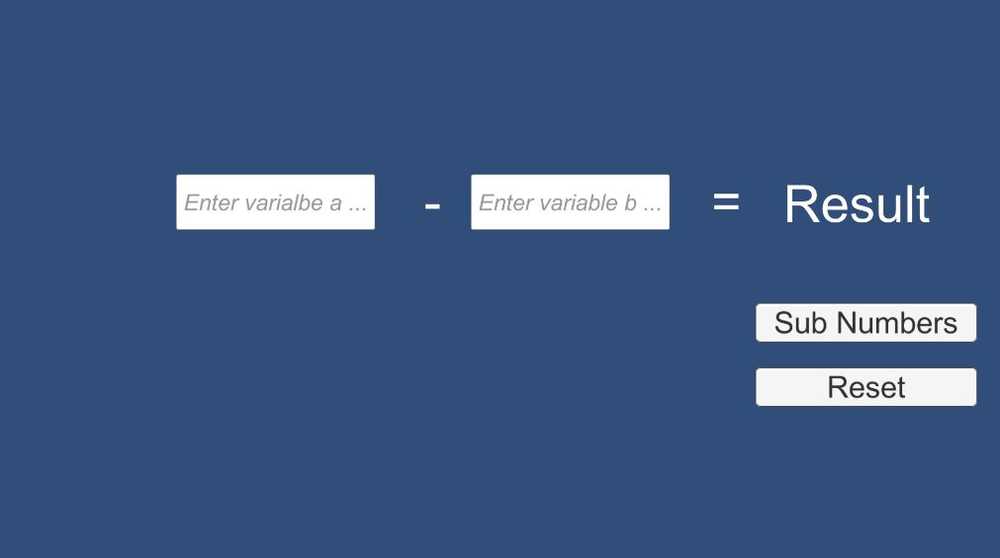

# inclass-simpleScript-cs-smeerws

### Project description: 
This Unity 2D project serves to practice C# and to repeat C# Concepts and basics. 
When pressing the subsraction button, the program takes the text from two InputFields (a and b), parse them to int, and substracts b from a.

### Development platform: 
Windows 10; 
Unity Version: 2019.1.14f1; 
Visual Studio Version: Microsoft Visual Studio Community 2017, Version 15.9.17;
Scripting Runtime Version: 4.X;

### Target platform: 
WebGL 960x600

### Visuals: 

## GUI - Screenshot 

### Necessary setup/execution steps: 
Installation process, e.g. step by step instructions that I can run the project after cloning it

* Nothing needed to run program in Unity

### Third party material: 
(if used Fonts, Sounds, Music, Graphics, Materials, Code etc.)

* None 

### Project state: 
100%

### Limitations: None
* Compile time error when Inputfield is empty
* Reset Button not working

### Lessons Learned: 
* GUI: Screenindependent Settings (Canvas); using Canvas, InputField, Text, Button 
* Write a simple Script: using variables, methods, take input from GameObjects (e.g., Inputfield), manipulate GameObject components (e.g. Text)
* Attach script to GameObject

Copyright by smeerws
